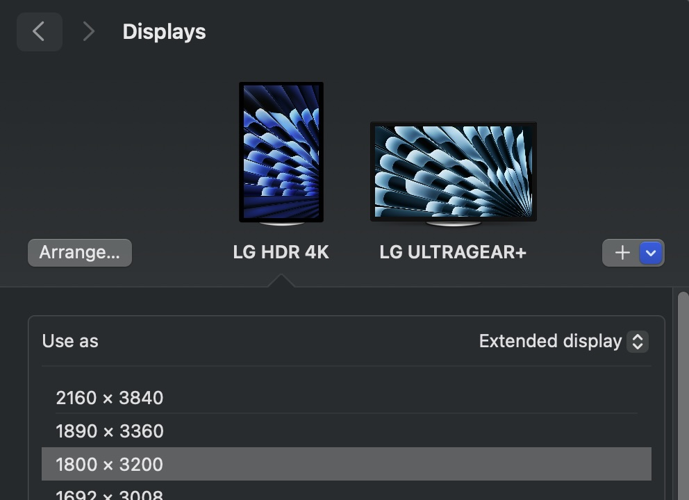

# sdl_gpu crash

`./build_and_run.sh` will invoke cmake to build and run the project in `build/`. You may need to set `SDL3_DIR` in the shell environment to help CMake find SDL3.

Version tested: SDL3-3.2.10

It seems to occur when window's present mode is set to SDL_GPU_PRESENTMODE_IMMEDIATE, and the window is on my 120hz monitor. It does not occur on my 60hz monitor.  Here's my monitor layout:



## Mac crash log

```
Attempting to forcibly halt cpu 0
cpu 0 failed to halt with error -5: halt not supported for this configuration
Attempting to forcibly halt cpu 1
cpu 1 failed to halt with error -5: halt not supported for this configuration
Attempting to forcibly halt cpu 3
cpu 3 failed to halt with error -5: halt not supported for this configuration
Attempting to forcibly halt cpu 4
cpu 4 failed to halt with error -5: halt not supported for this configuration
Attempting to forcibly halt cpu 5
cpu 5 failed to halt with error -5: halt not supported for this configuration
Attempting to forcibly halt cpu 6
cpu 6 failed to halt with error -5: halt not supported for this configuration
Attempting to forcibly halt cpu 7
cpu 7 failed to halt with error -5: halt not supported for this configuration
Attempting to forcibly halt cpu 8
cpu 8 failed to halt with error -5: halt not supported for this configuration
Attempting to forcibly halt cpu 9
cpu 9 failed to halt with error -5: halt not supported for this configuration
Attempting to forcibly halt cpu 10
cpu 10 failed to halt with error -5: halt not supported for this configuration
Attempting to forcibly halt cpu 11
cpu 11 failed to halt with error -5: halt not supported for this configuration
Unable to obtain state for cpu 0 with status -5: halt not supported for this configuration
Unable to obtain state for cpu 1 with status -5: halt not supported for this configuration
Unable to obtain state for cpu 3 with status -5: halt not supported for this configuration
Unable to obtain state for cpu 4 with status -5: halt not supported for this configuration
Unable to obtain state for cpu 5 with status -5: halt not supported for this configuration
Unable to obtain state for cpu 6 with status -5: halt not supported for this configuration
Unable to obtain state for cpu 7 with status -5: halt not supported for this configuration
Unable to obtain state for cpu 8 with status -5: halt not supported for this configuration
Unable to obtain state for cpu 9 with status -5: halt not supported for this configuration
Unable to obtain state for cpu 10 with status -5: halt not supported for this configuration
Unable to obtain state for cpu 11 with status -5: halt not supported for this configuration
Debugger synchronization timed out; timeout 240000 nanoseconds
panic(cpu 2 caller 0xfffffe001ececdf0): "AMCC0 DCS GROUP 0 CHANNEL 0 M3_AIC_IRQ_EN_FLD error: INTSTS 0x00000004, CLLT: sts/sts1 0x00003703/0x7f007f00 DISP0 0x7f7f0007 ISP 0x7f7f0007 SIO 0x7f7f0000 DISPEXT0/1/2/3 0x7f7f0007/0x7f740007/0x7f000007/0x7f7f0007 SCODEC 0x7f7f0007 EVTLOG sts/data0/data1 0x00000000/0x00000000/0x00000000" @AppleT6020PlatformErrorHandler.cpp:3468
Debugger message: panic
Memory ID: 0xff
OS release type: User
OS version: 24E248
Kernel version: Darwin Kernel Version 24.4.0: Wed Mar 19 21:17:25 PDT 2025; root:xnu-11417.101.15~1/RELEASE_ARM64_T6020
Fileset Kernelcache UUID: 9FFC701A32D7D7A222AEBD6BA597A971
Kernel UUID: FE69CD95-2227-3476-863E-FC0921745E33
Boot session UUID: D0CF2061-33AE-4D2C-8CDB-35485669F344
iBoot version: iBoot-11881.101.1
iBoot Stage 2 version: iBoot-11881.101.1
secure boot?: YES
roots installed: 0
Paniclog version: 14
KernelCache slide: 0x0000000014acc000
KernelCache base:  0xfffffe001bad0000
Kernel slide:      0x0000000014ad4000
Kernel text base:  0xfffffe001bad8000
Kernel text exec slide: 0x000000001625c000
Kernel text exec base:  0xfffffe001d260000
mach_absolute_time: 0x263812380
Epoch Time:        sec       usec
  Boot    : 0x67ed16ab 0x0006d20e
  Sleep   : 0x00000000 0x00000000
  Wake    : 0x00000000 0x00000000
  Calendar: 0x67ed1850 0x000bf45e

Zone info:
  Zone map: 0xfffffe1126000000 - 0xfffffe3726000000
  . VM    : 0xfffffe1126000000 - 0xfffffe16f2000000
  . RO    : 0xfffffe16f2000000 - 0xfffffe198c000000
  . GEN0  : 0xfffffe198c000000 - 0xfffffe1f58000000
  . GEN1  : 0xfffffe1f58000000 - 0xfffffe2524000000
  . GEN2  : 0xfffffe2524000000 - 0xfffffe2af0000000
  . GEN3  : 0xfffffe2af0000000 - 0xfffffe30bc000000
  . DATA  : 0xfffffe30bc000000 - 0xfffffe3726000000
  Metadata: 0xfffffe1010010000 - 0xfffffe1019810000
  Bitmaps : 0xfffffe1019810000 - 0xfffffe1025548000
  Extra   : 0 - 0

TPIDRx_ELy = {1: 0xfffffe198f1e5f40  0: 0x0000000000000002  0ro: 0x0000000203ad4d20 }
CORE 0 PVH locks held: None
CORE 1 PVH locks held: None
CORE 2 PVH locks held: None
CORE 3 PVH locks held: None
CORE 4 PVH locks held: None
CORE 5 PVH locks held: None
CORE 6 PVH locks held: None
CORE 7 PVH locks held: None
CORE 8 PVH locks held: None
CORE 9 PVH locks held: None
CORE 10 PVH locks held: None
CORE 11 PVH locks held: None
CORE 0: PC=0xfffffe001d2fd9c4, LR=0xfffffe001d2fd9c4, FP=0xfffffe382883bed0
CORE 1: PC=0xfffffe001d2fd9c4, LR=0xfffffe001d2fd9c4, FP=0xfffffe38267b7ed0
CORE 2 is the one that panicked. Check the full backtrace for details.
CORE 3: PC=0xfffffe001d2fd9c4, LR=0xfffffe001d2fd9c4, FP=0xfffffe382836fed0
CORE 4: PC=0xfffffe001d2fd9c4, LR=0xfffffe001d2fd9c4, FP=0xfffffe3828a3bed0
CORE 5: PC=0xfffffe001d2fd9c8, LR=0xfffffe001d2fd9c4, FP=0xfffffe3828203ed0
CORE 6: PC=0xfffffe001d2fd9c4, LR=0xfffffe001d2fd9c4, FP=0xfffffe3828267ed0
CORE 7: PC=0x0000000000000000, LR=0x0000000000000000, FP=0x0000000000000000
CORE 8: PC=0xfffffe001d2fd9c4, LR=0xfffffe001d2fd9c4, FP=0xfffffe38284f3ed0
CORE 9: PC=0x0000000000000000, LR=0x0000000000000000, FP=0x0000000000000000
CORE 10: PC=0xfffffe001d2fd9c8, LR=0xfffffe001d2fd9c4, FP=0xfffffe3827c03ed0
CORE 11: PC=0xfffffe001d424388, LR=0xfffffe001d424384, FP=0xfffffe3827513e40
Compressor Info: 0% of compressed pages limit (OK) and 0% of segments limit (OK) with 0 swapfiles and OK swap space
Panicked task 0xfffffe252683aaf8: 2720 pages, 5 threads: pid 402: WindowManager
Panicked thread: 0xfffffe198f1e5f40, backtrace: 0xfffffec134006f80, tid: 4874
		  lr: 0xfffffe001d2c0ae0  fp: 0xfffffec134007010
		  lr: 0xfffffe001d420644  fp: 0xfffffec134007080
		  lr: 0xfffffe001d41e92c  fp: 0xfffffec134007140
		  lr: 0xfffffe001d26b8c0  fp: 0xfffffec134007150
		  lr: 0xfffffe001d2c03d8  fp: 0xfffffec134007520
		  lr: 0xfffffe001db4ad04  fp: 0xfffffec134007540
		  lr: 0xfffffe001ececdf0  fp: 0xfffffec134007690
		  lr: 0xfffffe001ececff4  fp: 0xfffffec134007f40
		  lr: 0xfffffe001e72fe38  fp: 0xfffffec134007fc0
		  lr: 0xfffffe001d421ecc  fp: 0xfffffec134007fe0
		  lr: 0xfffffe001d26b938  fp: 0xfffffec134007ff0
		  lr: 0xfffffe001d26b884  fp: 0x0000000000000000
      Kernel Extensions in backtrace:
         com.apple.driver.AppleT6020(1.0)[92ED98F1-1757-3D0F-96EA-D303AF4020D1]@0xfffffe001ece57d0->0xfffffe001ecf70f3
            dependency: com.apple.driver.AppleARMPlatform(1.0.2)[7E4C86DB-8979-3B59-9B1E-4D12030139DD]@0xfffffe001dd022d0->0xfffffe001dd582ef
            dependency: com.apple.driver.AppleFireStormErrorHandler(1)[3E5CFC3D-3612-302D-89F3-BDD73EE7E12B]@0xfffffe001e4657e0->0xfffffe001e4666fb
            dependency: com.apple.iokit.IOReportFamily(47)[7CE55C92-8D7B-3857-B41C-B8A897DCC039]@0xfffffe001fc5a920->0xfffffe001fc5d7d7
         com.apple.driver.AppleInterruptControllerV2(1.0d1)[8DB4EDCE-397B-3729-820C-66A4282E7C49]@0xfffffe001e72e310->0xfffffe001e730c07
            dependency: com.apple.driver.AppleARMPlatform(1.0.2)[7E4C86DB-8979-3B59-9B1E-4D12030139DD]@0xfffffe001dd022d0->0xfffffe001dd582ef

last started kext at 421793067: com.apple.filesystems.autofs	3.0 (addr 0xfffffe001c672e50, size 5927)
loaded kexts:
com.apple.filesystems.autofs	3.0
com.apple.driver.AppleBiometricServices	1
com.apple.driver.CoreKDL	1
com.apple.AppleEthernetAquantiaAqtionFirmware	1.0.36
com.apple.driver.usb.realtek8153patcher	5.0.0
com.apple.driver.usb.AppleUSBHostBillboardDevice	1.0
com.apple.driver.DiskImages.ReadWriteDiskImage	493.0.0
com.apple.driver.DiskImages.UDIFDiskImage	493.0.0
com.apple.driver.DiskImages.RAMBackingStore	493.0.0
com.apple.driver.DiskImages.FileBackingStore	493.0.0
com.apple.driver.AppleAOPVoiceTrigger	440.4
com.apple.driver.AppleUSBDeviceNCM	5.0.0
com.apple.driver.AppleFileSystemDriver	3.0.1
com.apple.nke.l2tp	1.9
com.apple.filesystems.tmpfs	1
com.apple.filesystems.nfs	1
com.apple.filesystems.lifs	1
com.apple.filesystems.apfs	2332.101.1
com.apple.IOTextEncryptionFamily	1.0.0
com.apple.filesystems.hfs.kext	683.100.9
com.apple.security.BootPolicy	1
com.apple.BootCache	40
com.apple.AppleFSCompression.AppleFSCompressionTypeZlib	1.0.0
com.apple.AppleFSCompression.AppleFSCompressionTypeDataless	1.0.0d1
com.apple.driver.AppleSleepPowerPolicy	1
com.apple.driver.AppleSmartBatteryManager	161.0.0
com.apple.driver.AppleThunderboltIP	4.0.3
com.apple.driver.AppleGL3590FirmwareUpdater	1
com.apple.driver.SEPHibernation	1
com.apple.driver.AppleSmartIO2	1
com.apple.driver.ApplePMP	1
com.apple.AppleEmbeddedSimpleSPINORFlasher	1
com.apple.driver.AppleCS42L84Audio	840.26
com.apple.driver.AppleTypeCRetimer	1.0.0
com.apple.driver.AppleSN012776Amp	840.26
com.apple.driver.AppleT6020CLPC	1
com.apple.driver.AppleT6020SOCTuner	1
com.apple.driver.ApplePMPFirmware	1
com.apple.driver.AppleInterruptControllerV2	1.0.0d1
com.apple.driver.AppleS8000DWI	1.0.0d1
com.apple.driver.AppleS8000AES	1
com.apple.driver.AudioDMAController-T602x	440.40
com.apple.driver.AppleS5L8960XNCO	1
com.apple.driver.AppleT6021PMGR	1
com.apple.driver.AppleEventLogHandler	1
com.apple.driver.AppleSamsungSerial	1.0.0d1
com.apple.driver.AppleSerialShim	1
com.apple.driver.usb.AppleSynopsysUSB40XHCI	1
com.apple.driver.AppleS5L8920XPWM	1.0.0d1
com.apple.driver.AppleProResHW	475.2
com.apple.driver.AppleJPEGDriver	7.6.8
com.apple.driver.AppleBCMWLANBusInterfacePCIe	1
com.apple.driver.AppleBluetoothModule	1
com.apple.driver.AppleAVE2	803.63.1
com.apple.driver.AppleAVD	862
com.apple.driver.AppleMobileDispT602X-DCP	140.0
com.apple.AGXG14X	325.34.1
com.apple.driver.AppleM68Buttons	1.0.0d1
com.apple.driver.AppleSDXC	3.5.3
com.apple.driver.AppleSPIMC	1
com.apple.driver.AppleT8110DART	1
com.apple.driver.AppleS5L8940XI2C	1.0.0d2
com.apple.driver.AppleT6020	1
com.apple.iokit.IOUserEthernet	1.0.1
com.apple.driver.usb.AppleUSBUserHCI	1
com.apple.iokit.IOKitRegistryCompatibility	1
com.apple.iokit.EndpointSecurity	1
com.apple.driver.AppleDiskImages2	385.101.1
com.apple.AppleSystemPolicy	2.0.0
com.apple.kec.InvalidateHmac	1
com.apple.kec.AppleEncryptedArchive	1
com.apple.driver.driverkit.serial	6.0.0
com.apple.driver.AppleMesaSEPDriver	100.99
com.apple.iokit.IOBiometricFamily	1
com.apple.driver.AppleEthernetAquantiaAqtion	1.0.64
com.apple.driver.usb.cdc.ecm	5.0.0
com.apple.driver.usb.cdc.acm	5.0.0
com.apple.driver.usb.serial	6.0.0
com.apple.driver.usb.IOUSBHostHIDDevice	1.2
com.apple.driver.usb.cdc	5.0.0
com.apple.driver.AppleUSBAudio	741.32
com.apple.iokit.IOAudioFamily	600.2
com.apple.vecLib.kext	1.2.0
com.apple.driver.AppleUVDMDriver	1.0.0
com.apple.driver.AppleUVDM	1.0.0
com.apple.driver.DiskImages.KernelBacked	493.0.0
com.apple.driver.AppleXsanScheme	3
com.apple.driver.AppleConvergedIPCOLYBTControl	1
com.apple.driver.AppleConvergedPCI	1
com.apple.driver.AppleBluetoothDebug	1
com.apple.driver.AppleAOPAudio	440.12
com.apple.driver.usb.AppleEmbeddedUSBXHCIPCI	1
com.apple.driver.usb.AppleUSBXHCIPCI	1.2
com.apple.driver.usb.networking	5.0.0
com.apple.nke.ppp	1.9
com.apple.driver.AppleBSDKextStarter	3
com.apple.kext.triggers	1.0
com.apple.filesystems.hfs.encodings.kext	1
com.apple.driver.AppleSyntheticGameController	12.4.12
com.apple.driver.AppleBTM	1.0.1
com.apple.driver.IOHIDPowerSource	1
com.apple.driver.AppleCallbackPowerSource	1
com.apple.driver.AppleThunderboltUSBDownAdapter	1.0.4
com.apple.driver.AppleThunderboltPCIDownAdapter	4.1.1
com.apple.driver.AppleThunderboltDPInAdapter	8.5.1
com.apple.driver.AppleThunderboltDPAdapterFamily	8.5.1
com.apple.driver.AppleSEPHDCPManager	1.0.1
com.apple.driver.AppleTrustedAccessory	1
com.apple.iokit.AppleSEPGenericTransfer	1
com.apple.driver.AppleDCPDPTXProxy	1.0.0
com.apple.driver.DCPDPFamilyProxy	1
com.apple.driver.AppleDiagnosticDataAccessReadOnly	1.0.0
com.apple.driver.AppleCSEmbeddedAudio	840.26
com.apple.driver.AppleEmbeddedAudio	840.26
com.apple.iokit.AppleARMIISAudio	440.17
com.apple.driver.IISAudioIsolatedStreamECProxy	440.17
com.apple.driver.ExclavesAudioKext	240.34
com.apple.driver.AppleI2CEthernetAquantia	1.0.0
com.apple.driver.AppleHPM	3.4.4
com.apple.driver.ApplePassthroughPPM	3.0
com.apple.driver.AppleSPU	1
com.apple.driver.AppleStockholmControl	1.0.0
com.apple.driver.AppleSPMIPMU	1.0.1
com.apple.driver.AppleDialogPMU	1.0.1
com.apple.AGXFirmwareKextG14XRTBuddy	1
com.apple.AGXFirmwareKextRTBuddy64	325.34.1
com.apple.iokit.IONVMeFamily	2.1.0
com.apple.driver.AppleNANDConfigAccess	1.0.0
com.apple.driver.AppleARMWatchdogTimer	1
com.apple.driver.AppleSART	1
com.apple.driver.ApplePMGR	1
com.apple.driver.AppleT8112TypeCPhy	1
com.apple.driver.AppleT8103TypeCPhy	1
com.apple.driver.AppleUSBXDCIARM	1.0
com.apple.driver.AppleUSBXDCI	1.0
com.apple.iokit.IOUSBDeviceFamily	2.0.0
com.apple.driver.usb.AppleSynopsysUSBXHCI	1
com.apple.driver.usb.AppleUSBXHCI	1.2
com.apple.driver.AppleEmbeddedUSBHost	1
com.apple.driver.usb.AppleUSBHub	1.2
com.apple.driver.usb.AppleUSBHostCompositeDevice	1.2
com.apple.driver.AppleSPMI	1.0.1
com.apple.driver.AppleA7IOP-MXWrap-v1	1.0.2
com.apple.driver.AppleBluetoothDebugService	1
com.apple.driver.AppleBCMWLANCore	1.0.0
com.apple.iokit.IO80211Family	1200.13.1
com.apple.driver.IOImageLoader	1.0.0
com.apple.driver.AppleOLYHAL	1
com.apple.driver.DCPAVFamilyProxy	1
com.apple.driver.AppleA7IOP-ASCWrap-v4	1.0.2
com.apple.iokit.IOMobileGraphicsFamily-DCP	343.0.0
com.apple.driver.AppleDCP	1
com.apple.driver.AppleFirmwareKit	1
com.apple.iokit.IOMobileGraphicsFamily	343.0.0
com.apple.driver.AppleM2ScalerCSCDriver	265.0.0
com.apple.driver.AppleH11ANEInterface	8.510.0
com.apple.iokit.IOGPUFamily	104.4.1
com.apple.driver.AppleMCA2-T602x	940.3
com.apple.driver.AppleEmbeddedAudioLibs	420.3
com.apple.driver.AppleFirmwareUpdateKext	1
com.apple.driver.AppleMobileApNonce	1
com.apple.driver.usb.AppleUSBHostPacketFilter	1.0
com.apple.driver.AppleDisplayCrossbar	1.0.0
com.apple.iokit.IODisplayPortFamily	1.0.0
com.apple.driver.AppleTypeCPhy	1
com.apple.driver.AppleT6000PCIeC	1
com.apple.driver.AppleMultiFunctionManager	1
com.apple.driver.corecapture	1.0.4
com.apple.driver.AppleThunderboltNHI	7.2.81
com.apple.iokit.IOThunderboltFamily	9.3.3
com.apple.iokit.IOPortFamily	1.0
com.apple.iokit.IOAVBFamily	1320.3
com.apple.plugin.IOgPTPPlugin	1340.12
com.apple.driver.AppleEthernetAquantiaAqtionPortMonitor	1.0.0
com.apple.driver.AppleT602xPCIe	1
com.apple.driver.AppleT6020PCIePIODMA	1
com.apple.driver.AppleEmbeddedPCIE	1
com.apple.driver.ApplePIODMA	1
com.apple.driver.AppleGPIOICController	1.0.2
com.apple.driver.AppleFireStormErrorHandler	1
com.apple.iokit.IOTimeSyncFamily	1340.12
com.apple.driver.DiskImages	493.0.0
com.apple.iokit.IOGraphicsFamily	599
com.apple.iokit.IOBluetoothFamily	9.0.0
com.apple.driver.AppleUIO	1
com.apple.driver.AppleSSE	1.0
com.apple.driver.AppleSEPKeyStore	2
com.apple.driver.AppleUSBTDM	556
com.apple.iokit.IOUSBMassStorageDriver	259.100.1
com.apple.iokit.IOPCIFamily	2.9
com.apple.iokit.IOUSBHostFamily	1.2
com.apple.driver.AppleUSBHostMergeProperties	1.2
com.apple.driver.usb.AppleUSBCommon	1.0
com.apple.driver.AppleSMC	3.1.9
com.apple.driver.RTBuddy	1.0.0
com.apple.driver.AppleEmbeddedTempSensor	1.0.0
com.apple.driver.AppleARMPMU	1.0
com.apple.iokit.IOAccessoryManager	1.0.0
com.apple.driver.AppleOnboardSerial	1.0
com.apple.iokit.IOSerialFamily	11
com.apple.iokit.IOSCSIBlockCommandsDevice	500.101.1
com.apple.iokit.IOSCSIArchitectureModelFamily	500.101.1
com.apple.driver.AppleRSMChannel	1
com.apple.iokit.IORSMFamily	1
com.apple.driver.AppleLockdownMode	1
com.apple.driver.AppleIPAppender	1.0
com.apple.iokit.IOSkywalkFamily	1.0
com.apple.driver.mDNSOffloadUserClient	1.0.1b8
com.apple.iokit.IONetworkingFamily	3.4
com.apple.driver.AppleFDEKeyStore	28.30
com.apple.driver.AppleEffaceableStorage	1.0
com.apple.driver.AppleCredentialManager	1.0
com.apple.driver.AppleSEPManager	1.0.1
com.apple.driver.IODARTFamily	1
com.apple.driver.AppleA7IOP	1.0.2
com.apple.driver.IOSlaveProcessor	1
com.apple.driver.AppleBiometricSensor	2
com.apple.iokit.IOHIDFamily	2.0.0
com.apple.driver.AppleANELoadBalancer	8.510.0
com.apple.AUC	1.0
com.apple.iokit.IOSurface	372.5.2
com.apple.iokit.IOAVFamily	1.0.0
com.apple.iokit.IOHDCPFamily	1.0.0
com.apple.iokit.IOCECFamily	1
com.apple.iokit.IOAudio2Family	1.0
com.apple.driver.AppleIISController	440.2
com.apple.driver.AppleAudioClockLibs	420.3
com.apple.driver.FairPlayIOKit	72.13.0
com.apple.driver.AppleARMPlatform	1.0.2
com.apple.iokit.IOSlowAdaptiveClockingFamily	1.0.0
com.apple.iokit.IOReportFamily	47
com.apple.security.quarantine	4
com.apple.security.sandbox	300.0
com.apple.iokit.IOStorageFamily	2.1
com.apple.kext.AppleMatch	1.0.0d1
com.apple.driver.AppleMobileFileIntegrity	1.0.5
com.apple.iokit.CoreAnalyticsFamily	1
com.apple.security.AppleImage4	7.0.0
com.apple.kext.CoreTrust	1
com.apple.iokit.IOCryptoAcceleratorFamily	1.0.1
com.apple.kec.pthread	1
com.apple.kec.Libm	1
com.apple.kec.Compression	1.0
com.apple.kec.corecrypto	14.0


!! debugger synchronization failed, no stackshot !!
```
